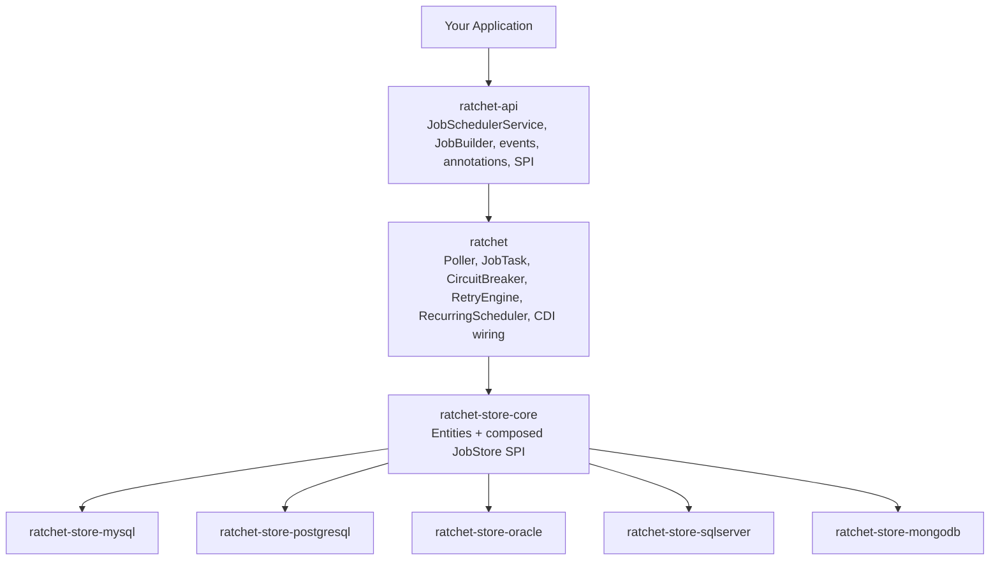

# Ratchet

**Portable, CDI-based job scheduler for Jakarta EE 10/11.**

Inject one service, submit a method call, and let Ratchet persist, claim, execute, retry, and observe the work — no heavyweight framework, no proprietary runtime.

```java
@ApplicationScoped
public class OrderService {

    @Inject JobSchedulerService scheduler;

    public void placeOrder(Order order) {
        // Persisted, claimed, executed on a worker, retried on failure.
        scheduler.enqueueNow(() -> processOrder(order.getId()));
    }

    void processOrder(UUID orderId) { /* your business logic */ }
}
```

**[Full documentation → ratchet.run](https://ratchet.run/)**

---

## Why Ratchet

- **Zero-ceremony CDI.** `@Inject JobSchedulerService` and go. No XML, no scheduler boilerplate, no separate daemon.
- **Real workflows, not just timers.** Chaining, conditional branching on results, batches, and jobs that park on an external signal until an approval or webhook resumes them.
- **Resilience built in.** Retries with backoff, a circuit breaker, and a dead-letter queue — no Resilience4j, no Flyway, no extra runtime deps.
- **Stores you can prove.** MySQL, PostgreSQL, Oracle, SQL Server, and MongoDB ship out of the box, each verified by a reusable store TCK. Bring your own and run the same conformance suite.
- **Customizable to the core** — see below.
- **Portable.** Plain Jakarta EE 10/11. Runs on WildFly, Open Liberty, Payara, GlassFish, and friends, plus Quarkus (JVM and native) through the `ratchet-quarkus` extension.

[Full feature tour →](https://ratchet.run/getting-started/introduction)

## Built to be customized

Almost every moving part of Ratchet is an SPI you can swap with a single CDI `@Alternative` bean — no forking, no config files. Override one interface and the engine picks it up at deploy time:

```java
@Alternative
@Priority(jakarta.interceptor.Interceptor.Priority.APPLICATION)
@ApplicationScoped
public class PaymentRetryPolicy implements RetryPolicy {
    @Override
    public boolean shouldRetry(int attempt, Throwable cause) {
        // Stop early on a hard decline; otherwise let maxRetries decide.
        return !(cause instanceof PaymentDeclinedException);
    }

    @Override
    public Duration getDelay(int attempt) {
        // Defer to the job's configured backoff policy.
        return Duration.ZERO;
    }
}
```

Swap the retry logic, circuit-breaker behavior, polling cadence, thread/executor strategy, payload encryption, key provider, metrics sink, per-job logging, node identity, cluster wakeups, the deserialization allowlist, and more — over **two dozen extension points** in all, each with a sensible default you only replace when you need to.

[SPI extension guide →](https://ratchet.run/advanced/spi-implementation) · [Full SPI reference →](https://ratchet.run/api-reference/spi-interfaces)

## Quick Start

```xml
<dependencyManagement>
  <dependencies>
    <dependency>
      <groupId>run.ratchet</groupId>
      <artifactId>ratchet-bom</artifactId>
      <version>0.3.1</version>
      <type>pom</type>
      <scope>import</scope>
    </dependency>
  </dependencies>
</dependencyManagement>

<dependencies>
  <dependency>
    <groupId>run.ratchet</groupId>
    <artifactId>ratchet-api</artifactId>
  </dependency>
  <dependency>
    <groupId>run.ratchet</groupId>
    <artifactId>ratchet</artifactId>
  </dependency>
  <!-- Pick a store published in 0.1.1: ratchet-store-{postgresql,mysql,mongodb} -->
  <dependency>
    <groupId>run.ratchet</groupId>
    <artifactId>ratchet-store-postgresql</artifactId>
  </dependency>
</dependencies>
```

Then three things before your first job runs:

1. **Provide a `ClassPolicy`.** Ratchet refuses to start without a deserialization allowlist for job payloads — a security default, not a hurdle. A one-line `@Alternative` bean naming your packages does it.
2. **Apply the schema.** SQL stores ship plain DDL (`ddl/*-schema.sql`) — apply it however you manage migrations. MongoDB initializes itself.
3. **Schedule a job.** `scheduler.enqueueNow(() -> work())`, or use the builder for delays, priority, and options.

The [Quick Start guide](https://ratchet.run/getting-started/quickstart) walks through all three with copy-paste snippets.

## A taste of the API

```java
// Multi-step workflow with conditional branching
scheduler.enqueue(() -> riskService.assess(applicationId))
    .whenResult(RiskConditions::isLowRisk,  () -> autoApprove(applicationId))
    .whenResult(RiskConditions::isHighRisk, () -> manualReview(applicationId))
    .thenOnFailure(() -> escalate(applicationId))
    .submit();

// Declarative cron scheduling
@Recurring(cron = "0 0 2 * * ?", name = "Nightly Cleanup")
public void performCleanup() { /* runs at 2 AM UTC */ }

// Park a job until an external signal arrives (or it times out)
scheduler.enqueue(() -> shipOrder(orderId))
    .awaitSignal("order:" + orderId + ":approved", Duration.ofHours(24))
    .submit();
```

More — batches, callbacks, encrypted payloads, event observation, job control:
[Workflows](https://ratchet.run/concepts/workflows) · [Recurring jobs](https://ratchet.run/concepts/scheduling) · [Signals](https://ratchet.run/concepts/job-lifecycle) · [Batches](https://ratchet.run/concepts/batches) · [Circuit breakers](https://ratchet.run/advanced/circuit-breakers) · [Payload encryption](https://ratchet.run/advanced/payload-encryption) · [API reference](https://ratchet.run/api-reference/overview)

## Showcase App

`ratchet-showcase` is a runnable Jakarta EE WAR with an order-fulfillment dashboard demonstrating live workflow chains, conditional fraud-review signals, retries, resource limits, queue health, and Prometheus metrics. See [`testing/ratchet-showcase/README.md`](./testing/ratchet-showcase/README.md) to run it on WildFly, Payara, Open Liberty, or GlassFish against PostgreSQL, MySQL, Oracle, SQL Server, or MongoDB.

## Architecture



Pluggable stores, optional cluster coordinators (PostgreSQL `LISTEN`/`NOTIFY`, JMS, Infinispan, Hazelcast), and reference encryption/metrics modules round out the reactor. [Module overview & deployment topology →](https://ratchet.run/deployment/overview)

## Documentation

| Start here | Go deeper |
|------------|-----------|
| [Introduction](https://ratchet.run/getting-started/introduction) | [Core concepts](https://ratchet.run/concepts/overview) |
| [Quick Start](https://ratchet.run/getting-started/quickstart) | [SPI & customization](https://ratchet.run/advanced/spi-implementation) |
| [Installation](https://ratchet.run/getting-started/installation) | [Deployment & clustering](https://ratchet.run/deployment/overview) |
| [API reference](https://ratchet.run/api-reference/overview) | [Troubleshooting](https://ratchet.run/troubleshooting/overview) |

## Requirements

- **Java** 17+
- **Jakarta EE** 10/11 (CDI 4.0/4.1, JPA 3.1/3.2, Interceptors 2.1/2.2, Concurrency 3.0/3.1)
- **Runtime** Jakarta EE 10/11 server with managed executors (WildFly, Open Liberty, Payara, GlassFish 8, …), or Quarkus on the JVM and native via the `ratchet-quarkus` extension; plain CDI/test deployments can opt into `StandaloneExecutorProvider`
- **Database** MySQL 8+, PostgreSQL 14+, Oracle 23ai+, SQL Server 2022+, or MongoDB 6+

## Building from Source

```bash
mvn clean compile        # compile all modules
mvn clean test           # unit tests
mvn clean verify         # unit + integration tests (requires Docker for Testcontainers)
mvn spotless:apply       # auto-format (Google Java Format)
```

## Project Status

Ratchet is in **0.3.1**. The API is stabilizing; interfaces marked `@Incubating` may change between alpha releases. Feedback and contributions are welcome.

## Community

- [Contributing guide](./.github/CONTRIBUTING.md) · [Support](./.github/SUPPORT.md) · [Security policy](./.github/SECURITY.md) · [Code of conduct](./.github/CODE_OF_CONDUCT.md)
- [Issues](https://github.com/ratchet-run/ratchet/issues) · [Discussions](https://github.com/ratchet-run/ratchet/discussions)

## License

Ratchet is licensed under the [Apache License 2.0](./LICENSE).
