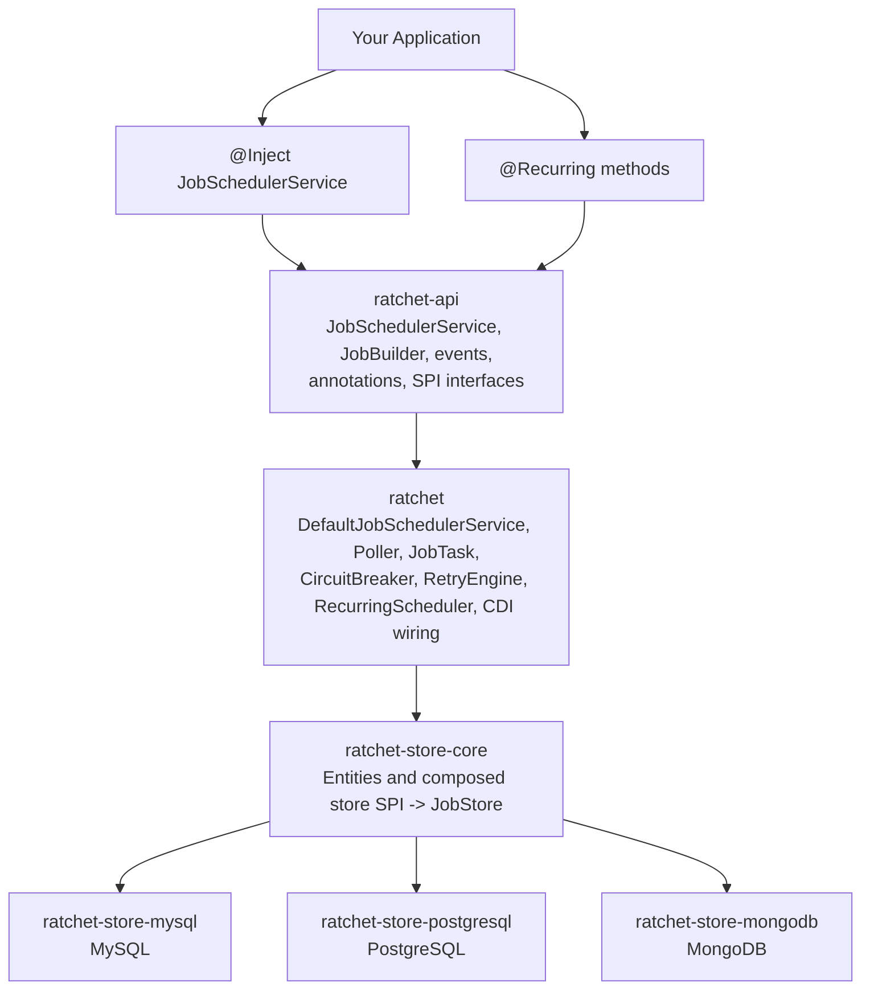

# Ratchet

**Portable, CDI-based job scheduler for Jakarta EE 10/11.**

---

> [!TIP]
> **Working on multi-tenant SaaS or AI on AWS?** I do one-week, fixed-price code audits. [audits.putney.io →](https://audits.putney.io)

---

Ratchet gives Jakarta EE 10/11 applications a clean, annotation-driven API for background job scheduling with persistent storage, automatic retries, workflow orchestration, and built-in resilience — all without pulling in heavyweight frameworks.

---

## Features

| Category | Capabilities |
|----------|-------------|
| **Scheduling** | Immediate, delayed, cron-based recurring jobs |
| **Workflows** | Job chaining, conditional branching, success/failure callbacks |
| **Batching** | In-memory batch builder and streaming batch for large datasets |
| **Resilience** | Configurable retries with backoff (fixed/exponential), built-in circuit breaker, dead letter queue |
| **Persistence** | Pluggable store SPI — MySQL, PostgreSQL, and MongoDB out of the box |
| **Observability** | Rich event system (CDI + programmatic), Micrometer metrics adapter |
| **Concurrency** | Permit-based backpressure, adaptive polling, resource limiting |
| **CDI Integration** | Zero-ceremony wiring — inject `JobSchedulerService` and go |

## Quick Start

### 1. Add Dependencies

Import the BOM and pick your store:

```xml
<dependencyManagement>
  <dependencies>
    <dependency>
      <groupId>run.ratchet</groupId>
      <artifactId>ratchet-bom</artifactId>
      <version>0.1.0-SNAPSHOT</version>
      <type>pom</type>
      <scope>import</scope>
    </dependency>
  </dependencies>
</dependencyManagement>

<dependencies>
  <!-- Core API -->
  <dependency>
    <groupId>run.ratchet</groupId>
    <artifactId>ratchet-api</artifactId>
  </dependency>

  <!-- Reference implementation -->
  <dependency>
    <groupId>run.ratchet</groupId>
    <artifactId>ratchet</artifactId>
  </dependency>

  <!-- Pick your store -->
  <dependency>
    <groupId>run.ratchet</groupId>
    <artifactId>ratchet-store-postgresql</artifactId>
  </dependency>

  <!-- Optional: Micrometer metrics -->
  <dependency>
    <groupId>run.ratchet</groupId>
    <artifactId>ratchet-micrometer</artifactId>
  </dependency>
</dependencies>
```

### 2. Install a `ClassPolicy`

Ratchet refuses to start until you provide a deserialization allowlist for job payloads. Add a CDI alternative that permits your application's packages:

```java
@Alternative
@Priority(jakarta.interceptor.Interceptor.Priority.APPLICATION)
@ApplicationScoped
public class AppClassPolicy implements ClassPolicy {

    @Override
    public boolean isAllowed(String className) {
        return className.startsWith("com.example.");
    }
}
```

For demos and tests only, you can bypass the fail-fast startup check with `RatchetOptions.builder().security(s -> s.allowEmptyClassPolicy(true))`, but the default policy still rejects every job target.

### 3. Apply or Initialize the Schema

SQL stores ship DDL as plain SQL files — no Flyway dependency, no migration lock-in. Apply the schema however your project manages DDL:

```bash
# PostgreSQL
psql -d mydb -f ratchet-store-postgresql/src/main/resources/ddl/postgresql-schema.sql

# MySQL
mysql mydb < ratchet-store-mysql/src/main/resources/ddl/mysql-schema.sql
```

For MongoDB, `ratchet-store-mongodb` creates the required collections and indexes at startup.

### 4. Schedule Your First Job

Inject `JobSchedulerService` into any CDI bean and start scheduling:

```java
@ApplicationScoped
public class OrderService {

    @Inject
    JobSchedulerService scheduler;

    public void placeOrder(Order order) {
        // Fire-and-forget
        scheduler.enqueueNow(() -> processOrder(order.getId()));

        // Delayed execution
        scheduler.schedule(Duration.ofMinutes(30), () -> sendReminder(order.getId()))
            .withPriority(JobPriority.LOW)
            .submit();
    }

    public void processOrder(UUID orderId) {
        // Your business logic here
    }

    public void sendReminder(UUID orderId) { /* ... */ }
}
```

> Job IDs are UUIDv7 values (`java.util.UUID`). The factory generates
> time-ordered IDs without operational coordination — no node-ID knob
> is required.

## Usage Guide

### Job Chaining and Workflows

Build multi-step workflows with conditional branching:

```java
scheduler.enqueue(() -> validatePayment(orderId))
    .thenOnSuccess(() -> fulfillOrder(orderId))
    .thenOnFailure(() -> notifyPaymentFailure(orderId))
    .withMaxRetries(3)
    .withBackoff(BackoffPolicy.EXPONENTIAL, Duration.ofSeconds(2))
    .submit();
```

Advanced workflows can branch on the result of previous steps:

```java
scheduler.enqueue(() -> riskService.assessRisk(applicationId))
    .whenResult(RiskConditions::isLowRisk, () -> autoApprove(applicationId))
    .whenResult(RiskConditions::isHighRisk, () -> manualReview(applicationId))
    .thenOnFailure(() -> escalateToManager(applicationId))
    .submit();
```

### Recurring Jobs

Use the `@Recurring` annotation for declarative cron scheduling:

```java
@ApplicationScoped
public class MaintenanceService {

    @Recurring(cron = "0 0 2 * * ?", name = "Nightly Cleanup")
    public void performCleanup() {
        // Runs at 2 AM daily (UTC)
    }

    @Recurring(
        cron = "0 */15 * * * ?",
        zone = "America/New_York",
        priority = 8,
        maxRetries = 5,
        backoffPolicy = BackoffPolicy.EXPONENTIAL,
        tags = {"health", "monitoring"}
    )
    public void healthCheck(JobContext context) {
        context.logger().info("Running health check");
    }
}
```

Or schedule programmatically:

```java
scheduler.scheduleRecurring(
    "0 */5 * * * ?",
    ZoneId.of("UTC"),
    () -> syncExternalData()
).withTags(List.of("sync")).submit();
```

### Batch Processing

Process collections in parallel with progress tracking:

```java
// In-memory batch
scheduler.enqueueBatch("process-invoices")
    .forEach(List.of(invoice1, invoice2, invoice3), inv -> processInvoice(inv))
    .submit();

// Streaming batch for large datasets
scheduler.<Invoice>streamingBatch("import-invoices")
    .fromStream(invoiceStream)
    .process(invoice -> importInvoice(invoice))
    .withChunkSize(100)
    .start();
```

### Circuit Breaker Protection

Protect external service calls with the built-in circuit breaker — no Resilience4j required:

```java
@CircuitBreakerProtected(
    service = "payment-gateway",
    profile = CircuitBreakerProfile.EXTERNAL_API
)
public PaymentResult processPayment(PaymentRequest request) {
    return gateway.charge(request);
}
```

### Event Observation

Monitor job lifecycle via CDI observers or programmatic listeners:

```java
// CDI observer
public void onJobFailed(@Observes JobFailedEvent event) {
    log.error("Job " + event.getJobId() + " failed: " + event.getErrorMessage());
    alerting.notify(event);
}

// Programmatic listener
scheduler.addEventListener(event -> {
    if (event instanceof PerformanceMetricsEvent metrics) {
        dashboard.update(metrics);
    }
});
```

### Job Control

Manage running jobs at runtime:

```java
JobHandle handle = scheduler.enqueue(() -> longRunningTask())
    .withTimeout(Duration.ofMinutes(30))
    .withIdempotencyKey("import-2024-q4")
    .withBusinessKey("quarterly-import")
    .withTags("import", "finance")
    .submit();

UUID jobId = handle.id();

scheduler.pauseJob(jobId);    // Pause a pending or failed job
scheduler.resumeJob(jobId);   // Resume a paused job
scheduler.cancelJob(jobId);   // Cancel a job
scheduler.retryJob(jobId);    // Retry a failed job (resets to PENDING)
```

### Callbacks

Attach success and failure handlers:

```java
scheduler.enqueue(() -> generateReport(reportId))
    .onSuccess(ctx -> notifyUser(ctx.param("email"), "Report ready"))
    .onFailure((ctx, error) -> log.error("Report " + reportId + " failed", error))
    .withParam("email", user.getEmail())
    .submit();
```

## Architecture



### Module Overview

| Module | Purpose | Dependencies |
|--------|---------|-------------|
| `ratchet-api` | Public API, annotations, events, SPI interfaces | Jakarta CDI / Interceptors APIs (provided) |
| `ratchet` | Core engine — polling, execution, retry, circuit breaker, CDI wiring | ratchet-api, ratchet-store-core, ASM, cron-utils, JBoss Logging; Jakarta EE APIs provided by the runtime |
| `ratchet-store-core` | Persistence abstractions — entities and composed `JobStore` SPI | ratchet-api, Jakarta Persistence / JSON APIs |
| `ratchet-store-mysql` | MySQL store implementation with optimized DDL | ratchet-store-core |
| `ratchet-store-postgresql` | PostgreSQL store with partial indexes and JSONB | ratchet-store-core |
| `ratchet-store-mongodb` | MongoDB document store implementation | ratchet-store-core |
| `ratchet-micrometer` | Micrometer metrics adapter | ratchet-api, Micrometer |
| `ratchet-tck` | Aggregator (pom-packaging) for the four TCK submodules below | — |
| `ratchet-tck-util` | JUnit-only helpers shared across TCK modules | JUnit 5 |
| `ratchet-tck-store` | Store SPI conformance — CRUD, claiming, status transitions, archiving, batches, locks | ratchet-store-core, ratchet-tck-util, JUnit 5 |
| `ratchet-tck-api` | Public-API conformance — submit / cancel / retry / idempotency / workflow / delayed scheduling. Container-free, pure-JVM JUnit | ratchet-api, ratchet-tck-util, JUnit 5 |
| `ratchet-tck-jakarta` | Jakarta-EE conformance — CDI injection, CDI events, JTA enqueue (Arquillian-driven) | ratchet-tck-api, Jakarta CDI / Transaction API, Arquillian |
| `ratchet-bom` | Bill of Materials for version alignment | — |

### SPI Extension Points

Ratchet is designed to be extended. Provide a CDI `@Alternative @Priority(APPLICATION)` bean for any of these interfaces:

| SPI Interface | Purpose | Default |
|---------------|---------|---------|
| `RetryPolicy` | Custom retry/no-retry decisions | Defers to `maxRetries` |
| `ResilienceStrategy` | Circuit breaker behavior | Built-in 3-state machine |
| `ClassPolicy` | Security — which classes can be deserialized | `PackagePrefixClassPolicy` with an empty allowlist; startup fails fast until you provide an override |
| `ErrorSanitizer` | Scrub sensitive data from error messages | `DefaultErrorSanitizer` |
| `RatchetOptions` | Required runtime options bean; deployment fails without a CDI producer | Application-provided via `@Produces`; use `RatchetOptionsFactory.fromEnvironment()` for env-driven configuration |
| `RatchetConfigSource` | Platform config overlay passed to `RatchetOptionsFactory.fromEnvironment(...)` | Optional |
| `ExecutionTuningProvider` | Per-execution-type concurrency and virtual-thread limits | Config-backed defaults |
| `PollingStrategyProvider` | Poll cadence and adaptive backoff | Built-in adaptive strategy |
| `JobInvocationResolver` | Method reference extraction from submitted callbacks | ASM bytecode analysis |
| `ResultPersistenceStrategy` | Job return-value serialization | JSON metadata with a size cap |
| `JobLoggerFactory` | Per-job job-scoped logging | JBoss Logging-backed logger |
| `CircuitBreakerConfigProvider` | Built-in breaker enablement and thresholds | Config-backed profile settings |
| `SchedulerLifecycleHook` | Scheduler startup/shutdown hooks | No hooks |
| `ClusterCoordinator` | Distributed wakeup notifications | `NoOpClusterCoordinator` |
| `StartupCoordinator` | Destructive startup work gated by store-backed leases | `StoreBackedStartupCoordinator` |
| `MetricsCollector` | Metrics sink (counters, gauges, timers) | No-op |
| `BeanResolver` | Bean instantiation strategy | CDI `Instance<T>` |
| `ExecutorProvider` | Thread pool / virtual thread configuration | Jakarta Concurrency managed executors |
| `RatchetEntityManagerProvider` | SQL store `EntityManager` binding | Unnamed `@PersistenceContext` |
| `NodeIdentityProvider` | Node identification in clusters | Hostname-based |
| `JobLogger` | Per-job job-scoped logging facade | Created per execution by `JobLoggerFactory` |

### Custom Store Implementation

Implement the `JobStore` interface and validate your implementation using the TCK:

```java
// In your test module
public class MyCustomStoreTest extends AbstractJobCrudStoreContract {
    @Override
    public JobStore store() {
        return new MyCustomStore(dataSource);
    }

    @Override
    public JobEntity newPendingJob() { /* create a PENDING JobEntity */ }

    @Override
    public JobEntity newBatchParentJob() { /* create a batch parent JobEntity */ }

    @Override
    public void cleanupStore() { /* clear test data */ }
}
```

Ratchet uses tiered conformance. Each TCK submodule earns a distinct compatibility label:

- **Ratchet Store Compatible** — passes `ratchet-tck-store` against a custom `JobStore` (CRUD, claiming, status transitions, archiving, execution tracking, batches, locks).
- **Ratchet API Compatible** — passes `ratchet-tck-api` against a custom `JobSchedulerService` implementation. Pure-JVM JUnit, no container required. Covers submit / cancel / retry / idempotency / simple workflow; delayed-scheduling contracts skip when no `TestClock` is provided.
- **Ratchet Jakarta Runtime Compatible** — passes `ratchet-tck-api` plus `ratchet-tck-jakarta` (CDI injection, CDI events, JTA enqueue) in a Jakarta EE 10/11 container, typically via Arquillian.
- **Ratchet RI Verified** — the project's reference-implementation tests pass on a named runtime / database matrix. This is implementation-specific and lives in `ratchet-testsuite`.

## Production Checklist

Before deploying Ratchet to a production-shaped environment, work through this checklist. Each item is a footgun that has bitten someone, somewhere.

### Required

- [ ] **Configure `ClassPolicy`.** Out of the box, Ratchet ships a deny-all `PackagePrefixClassPolicy()`. The CDI producer **refuses to start** with an empty allowlist (`jakarta.enterprise.inject.spi.DeploymentException`). Provide your own `@Alternative @Priority` bean naming the package prefixes your application uses for job targets:
  ```java
  @Produces
  @Alternative
  @Priority(jakarta.interceptor.Interceptor.Priority.APPLICATION)
  @ApplicationScoped
  public ClassPolicy myClassPolicy() {
    return new PackagePrefixClassPolicy(Set.of("com.acme.jobs."));
  }
  ```
  A hardcoded denylist (`Runtime`, `ProcessBuilder`, `javax.script`, reflection, JDK internals) blocks well-known RCE gadgets regardless of allowlist content. To opt out of the fail-fast guard for demos and tests, set `RatchetOptions.security().allowEmptyClassPolicy(true)`.

- [ ] **Apply or initialize the schema.** SQL stores ship DDL as plain SQL files — no Flyway lock-in. Apply once per database before starting any node. See `ratchet-store-{mysql,postgresql}/src/main/resources/ddl/`. MongoDB collections and indexes are initialized by `ratchet-store-mongodb` at startup.

- [ ] **Use the store-specific UUID wiring.** PostgreSQL stores UUIDv7 IDs as native `uuid`. MySQL stores them as `BINARY(16)` and production persistence units must include `META-INF/orm-mysql.xml` from `ratchet-store-mysql` so non-Hibernate JPA providers route UUID fields through the store-local converter. MongoDB clients must use `UuidRepresentation.STANDARD`; prefer `MongoClientFactory.create(...)` or configure the supplied client explicitly.

- [ ] **Verify `READ COMMITTED` isolation.** Ratchet's claim/poll path assumes statement-level snapshotting. The default on most servers is correct; verify with `SELECT @@tx_isolation` (MySQL) or `SHOW default_transaction_isolation` (Postgres).

### Multi-node deployments

- [ ] **Decide whether you need cross-node wakeups.** Multi-node job claiming and recurring-scheduler singleton execution are already database-backed. Add a real `ClusterCoordinator` only if you want low-latency wakeups across nodes for CRITICAL or immediate jobs.

- [ ] **Keep the startup cleanup lease conservative if you override `StartupCoordinator`.** The default `StoreBackedStartupCoordinator` uses a store-backed lease so only one node performs destructive recurring-annotation cleanup during startup.

### Operational

- [ ] **Configure a `MeterRegistry`.** Add `ratchet-micrometer` to your classpath for drop-in metrics; Ratchet provides a `SimpleMeterRegistry` by default. For production, override with a real backend (Prometheus, Datadog, OpenTelemetry):
  ```java
  @Produces
  @Alternative
  @Priority(2000)
  @ApplicationScoped
  public MeterRegistry prometheusRegistry() {
    return new PrometheusMeterRegistry(PrometheusConfig.DEFAULT);
  }
  ```

- [ ] **Plan `scheduler_job_log` retention if you wire job-log persistence.** The default logger writes through JBoss Logging and publishes `JobLogLine` events, but database persistence of those events is an application integration choice. If you persist them, combine purging with your database's native partitioning strategy for high-volume installs.

- [ ] **Cap job result size if your jobs return large objects.** Default cap is 64KB (`ratchet.jobs.max-result-bytes`); larger results are truncated to a marker JSON noting the original size. Tune via `-D` or store large results out-of-band in object storage.

### Known limitations (0.1.0-alpha)

- **Per-job log persistence is not automatic.** `JobContext.logger()` is backed by JBoss Logging by default and publishes `JobLogLine` events. Persist those events only if your application wants database-backed per-job traces.
- **`@Incubating` SPIs may evolve.** Method names, parameters, and semantics on any interface marked `@Incubating` are subject to change between alpha releases.

## Requirements

- **Java**: 17+
- **Jakarta EE**: 10/11 (CDI 4.0/4.1, JPA 3.1/3.2, Interceptors 2.1/2.2, Jakarta Concurrency 3.0/3.1)
- **Runtime**: Jakarta EE 10/11 compatible server with managed executor support (WildFly, Open Liberty, Payara, GlassFish 8, etc.); plain CDI/test deployments can opt into `StandaloneExecutorProvider`
- **Database**: MySQL 8+, PostgreSQL 14+, or MongoDB 6+

## Building from Source

```bash
# Compile
mvn clean compile

# Run unit tests
mvn clean test

# Run unit + integration tests (requires Docker for Testcontainers)
mvn clean verify

# Auto-format code (Google Java Format)
mvn spotless:apply
```

## Project Status

Ratchet is currently in **0.1.0-SNAPSHOT** — the API is stabilizing but interfaces marked `@Incubating` may change. Feedback and contributions are welcome.

## Community

- [Contributing guide](./CONTRIBUTING.md)
- [Support](./SUPPORT.md)
- [Security policy](./SECURITY.md)
- [Code of conduct](./CODE_OF_CONDUCT.md)
- [Issues](https://github.com/ratchet-run/ratchet/issues)
- [Discussions](https://github.com/ratchet-run/ratchet/discussions)

## License

Ratchet is licensed under the [Apache License 2.0](./LICENSE).
